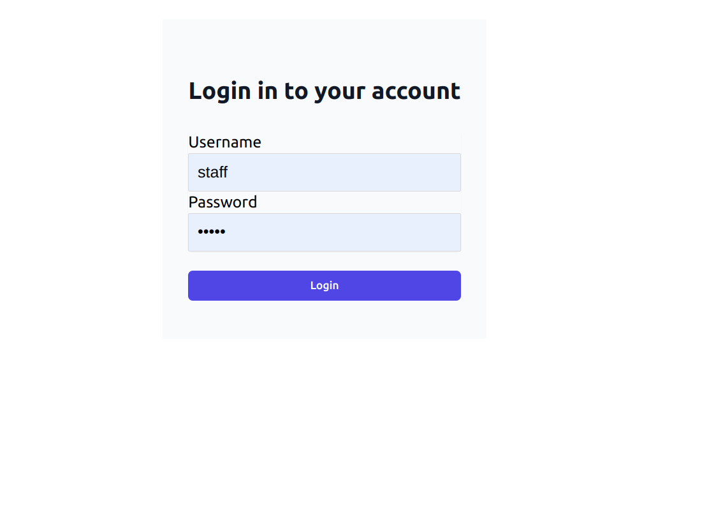
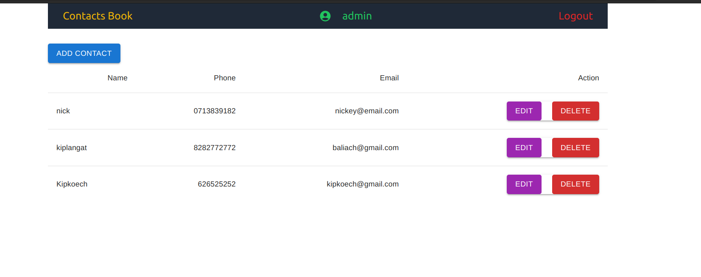
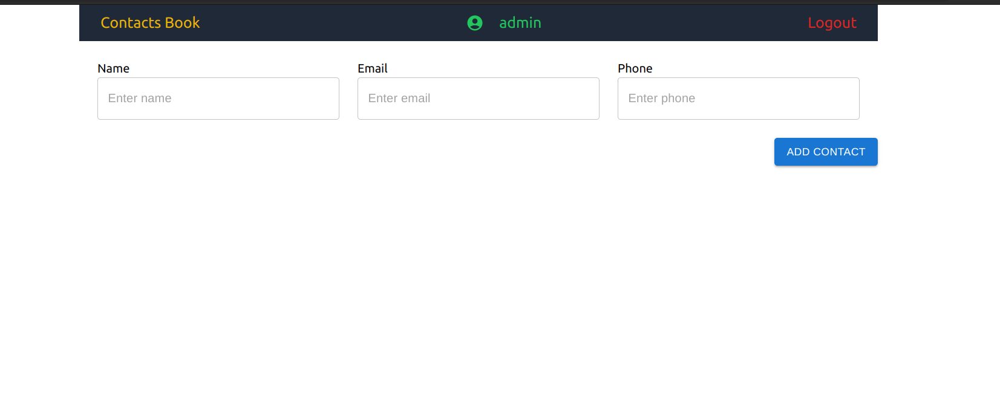
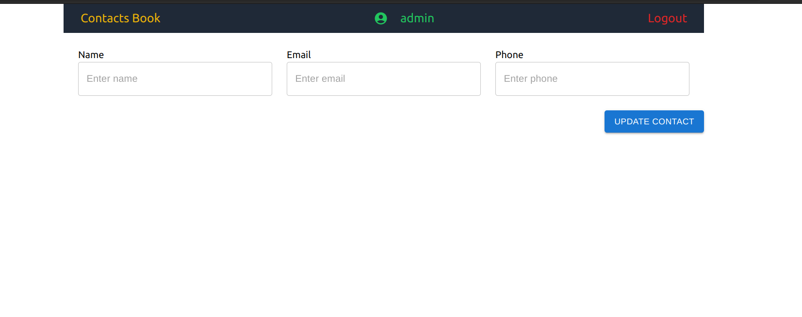

# LETA COMPANY REACT INTERVIEW TEST

### Project Overview

The goal of this challenge was to create a React application using TypeScript that manages a
simple list of contacts. The application will have the ability to add, edit, and delete contacts, as
well as authenticate users and manage their sessions.

### System UI

#### Login Page

The login page is designed to take `username` and `password` in which it will return `accessToken` and `refreshToken` for dashboard authentication. Check on the image below.

#### Contact Dashboard

The dashboard page contain different features like `Navbar`,which has some features like `Logout`,`username` and `page name` . The page also has a table which hold contacts from the `grpc web client`.

#### Add contact page

Add contact page contains input fields where a user can enter the data to create new contact which will be posted to the server and sent back as a response

#### Update contact page

Update contact page also contains input fields where a user update his or her contact. The delete functionality takes in the `contact ID` which it filters the contact and delete it returning the new array.

